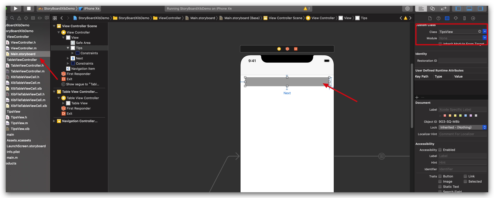
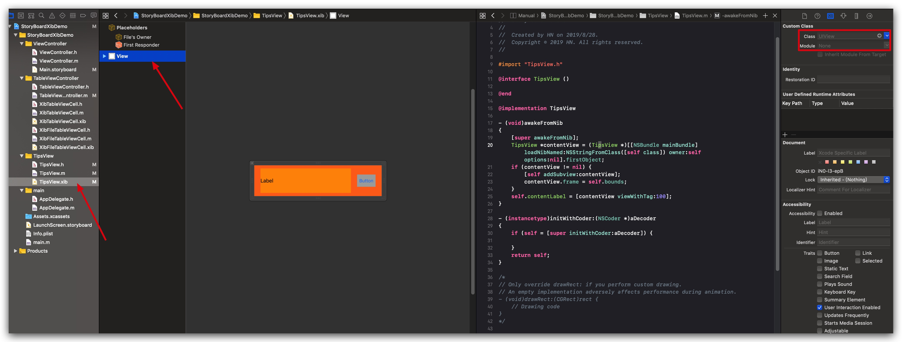
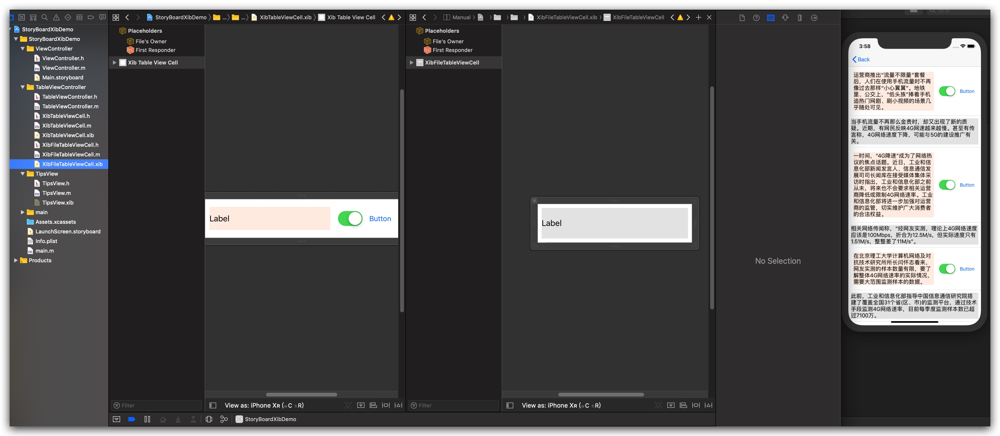

# StoryBoardXibDemo
关于使用`storyboard`、`xib`的使用

为了加快开发速度，提升效率。今天研究了一下`storyboard`、`xib`的使用。主要涉及了两个部分：

## 一、`storyboard`上加载自定义`xib`

网上只有`swift`版本，若需要请自行查找。这里主要介绍`Objective-C`版本。

效果图如下：


当控件中的文字发生改变时，控件需要自适应效果。相信纯代码肯定容易，但是`storyboard`或者`Xib`两者合并使用就会出现问题。这里主要主要两点：
#### 1、在`storyboard`中自定义控件属性的设置


#### 2、在自定义控件中的属性设置



## 二、`xib`自定义`cell`

毋庸质疑，开发过程中cell的自定义需要的太多了，但是不想总是撸代码，所以就想到了`xib`。其实`xib`的使用也有很多方式，但是这里主要介绍文字可变，高度自适应的情况。

效果图如下：


`demo`中`cell`的创建使用了两种方式：

#### 1、类文件和xib分开创建 （`XibTableViewCell`）

#### 2、类文件和xib分开创建 （`XibFileTableViewCell`）

不管使用哪种方式，都是带高度自适应的效果。实现方式如下：

因苹果官方自定API，所以不用每个cell进行计算，也不用设置cell的行高。
```
    self.tableView.rowHeight = UITableViewAutomaticDimension;
```

#### 附录：
 **博客地址：[Storyboard上加载自定义xib](https://www.jianshu.com/p/5e7b981e99ec)**
